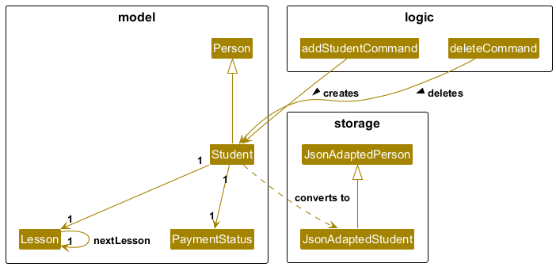

* Table of Contents
{:toc}

--------------------------------------------------------------------------------------------------------------------

## **Acknowledgements**

* **StudentConnect** is built upon the [**AB3(Address Book Level 3)**](https://se-education.org/addressbook-level3) project.
--------------------------------------------------------------------------------------------------------------------

## **Setting up, getting started**

Refer to the guide [_Setting up and getting started_](SettingUp.md).

--------------------------------------------------------------------------------------------------------------------

## **Design**

:bulb: **Tip:** The `.puml` files used to create diagrams are in this document `docs/diagrams` folder. Refer to the [_PlantUML Tutorial_ at se-edu/guides](https://se-education.org/guides/tutorials/plantUml.html) to learn how to create and edit diagrams.

### Architecture

The ***Architecture Diagram*** given above explains the high-level design of the App.

Given below is a quick overview of main components and how they interact with each other.

**Main components of the architecture**

**`Main`** (consisting of classes [`Main`](https://github.com/se-edu/addressbook-level3/tree/master/src/main/java/seedu/address/Main.java) and [`MainApp`](https://github.com/se-edu/addressbook-level3/tree/master/src/main/java/seedu/address/MainApp.java)) is in charge of the app launch and shut down.
* At app launch, it initializes the other components in the correct sequence, and connects them up with each other.
* At shut down, it shuts down the other components and invokes cleanup methods where necessary.

The bulk of the app's work is done by the following four components:

* [**`UI`**](#ui-component): The UI of the App.
* [**`Logic`**](#logic-component): The command executor.
* [**`Model`**](#model-component): Holds the data of the App in memory.
* [**`Storage`**](#storage-component): Reads data from, and writes data to, the hard disk.

[**`Commons`**](#common-classes) represents a collection of classes used by multiple other components.

**How the architecture components interact with each other**

The *Sequence Diagram* below shows how the components interact with each other for the scenario where the user issues the command `delete 1`.

Each of the four main components (also shown in the diagram above),

* defines its *API* in an `interface` with the same name as the Component.
* implements its functionality using a concrete `{Component Name}Manager` class (which follows the corresponding API `interface` mentioned in the previous point.

For example, the `Logic` component defines its API in the `Logic.java` interface and implements its functionality using the `LogicManager.java` class which follows the `Logic` interface. Other components interact with a given component through its interface rather than the concrete class (reason: to prevent outside component's being coupled to the implementation of a component), as illustrated in the (partial) class diagram below.

The sections below give more details of each component.

### UI component

The **API** of this component is specified in [`Ui.java`](https://github.com/se-edu/addressbook-level3/tree/master/src/main/java/seedu/address/ui/Ui.java)

The UI consists of a `MainWindow` that is made up of parts e.g.`CommandBox`, `ResultDisplay`, `PersonListPanel`, `StatusBarFooter` etc. All these, including the `MainWindow`, inherit from the abstract `UiPart` class which captures the commonalities between classes that represent parts of the visible GUI.

The `UI` component uses the JavaFx UI framework. The layout of these UI parts are defined in matching `.fxml` files that are in the `src/main/resources/view` folder. For example, the layout of the [`MainWindow`](https://github.com/se-edu/addressbook-level3/tree/master/src/main/java/seedu/address/ui/MainWindow.java) is specified in [`MainWindow.fxml`](https://github.com/se-edu/addressbook-level3/tree/master/src/main/resources/view/MainWindow.fxml)

The `UI` component,

* executes user commands using the `Logic` component.
* listens for changes to `Model` data so that the UI can be updated with the modified data.
* keeps a reference to the `Logic` component, because the `UI` relies on the `Logic` to execute commands.
* depends on some classes in the `Model` component, as it displays `Person` object residing in the `Model`.

### Logic component

**API** : [`Logic.java`](https://github.com/se-edu/addressbook-level3/tree/master/src/main/java/seedu/address/logic/Logic.java)

Here's a (partial) class diagram of the `Logic` component:

The sequence diagram below illustrates the interactions within the `Logic` component, taking `execute("delete 1")` API call as an example.

:information_source: **Note:** The lifeline for `DeleteCommandParser` should end at the destroy marker (X) but due to a limitation of PlantUML, the lifeline continues till the end of diagram.

How the `Logic` component works:

1. When `Logic` is called upon to execute a command, it is passed to an `AddressBookParser` object which in turn creates a parser that matches the command (e.g., `DeleteCommandParser`) and uses it to parse the command.
1. This results in a `Command` object (more precisely, an object of one of its subclasses e.g., `DeleteCommand`) which is executed by the `LogicManager`.
1. The command can communicate with the `Model` when it is executed (e.g. to delete a person). 
   Note that although this is shown as a single step in the diagram above (for simplicity), in the code it can take several interactions (between the command object and the `Model`) to achieve.
1. The result of the command execution is encapsulated as a `CommandResult` object which is returned back from `Logic`.

Here are the other classes in `Logic` (omitted from the class diagram above) that are used for parsing a user command:

How the parsing works:
* When called upon to parse a user command, the `AddressBookParser` class creates an `XYZCommandParser` (`XYZ` is a placeholder for the specific command name e.g., `AddCommandParser`) which uses the other classes shown above to parse the user command and create a `XYZCommand` object (e.g., `AddCommand`) which the `AddressBookParser` returns back as a `Command` object.
* All `XYZCommandParser` classes (e.g., `AddCommandParser`, `DeleteCommandParser`, ...) inherit from the `Parser` interface so that they can be treated similarly where possible e.g, during testing.

### Model component
**API** : [`Model.java`](https://github.com/se-edu/addressbook-level3/tree/master/src/main/java/seedu/address/model/Model.java)

#### The `Model` component,

* stores the address book data i.e., all `Person` objects (which are contained in a `UniquePersonList` object).
* stores the currently 'selected' `Person` objects (e.g., results of a search query) as a separate _filtered_ list which is exposed to outsiders as an unmodifiable `ObservableList<Person>` that can be 'observed' e.g. the UI can be bound to this list so that the UI automatically updates when the data in the list change.
* stores a `UserPref` object that represents the user’s preferences. This is exposed to the outside as a `ReadOnlyUserPref` objects.
* does not depend on any of the other three components (as the `Model` represents data entities of the domain, they should make sense on their own without depending on other components)

:information_source: **Note:** An alternative (arguably, a more OOP) model is given below. It has a `Tag` list in the `AddressBook`, which `Person` references. This allows `AddressBook` to only require one `Tag` object per unique tag, instead of each `Person` needing their own `Tag` objects. 

#### The `Student` Component
* The student component is a new component that is introduced in the application StudentConnect. It directly inherits from person and has two extra fields `Lesson` and `PaymentStatus`. 
* The behaviour of the student class is mostly similar to a person in the model as it directly inherits from a person. However, in TutorConnect, you can manage the most recent lesson of that student and the payment status of that particular student. Moreover, `students` can be labelled based on their respective education levels, which is a enum that records fixed values of education levels(such as P3, etc.)

#### The `Lesson` Component 
* The lesson component represents a single lesson that is owned by a student that is already instantiated in the student list. A Lesson is an **immutable object** that contains a single field of `lessonDate`, which is a `LocalDate` java object that records the date of a lesson. 
* There is a static instance of a singleton object stored in the `Lesson` class named `EMPTY`, which is represents the state where the student does not have any lesson. It is an instance of `Lesson`'s private subclass `EmptyLesson`. It seves as a check on whether the student has any lesson. It also handles all situations whenever an operation that deals with the lesson a student is called on a student while the student has no lesson.
* Another sub-class of lesson is called `RecurringLesson`, which handles lessons that regularly updates itself after a certain time interval. It has a `interval` field that tracks the number of days between each lesson.(See the next bullet point for more details)
* The behaviour of a lesson object largely are mostly tied to the commands that creates or deletes a lesson. Additionally, whenever the application is launched. TJe `ModelManager` will check whether the lesson date is past the current date. If so, the lesson will be updated by calling the method `getNextLesson()`, which returns the `EMPTY` instance for a normal lesson. However, for a recurring lesson, it will return a **new instance** of lesson whose date is `INTERVAL` days past the previous lesson date.

### Storage component

**API** : [`Storage.java`](https://github.com/se-edu/addressbook-level3/tree/master/src/main/java/seedu/address/storage/Storage.java)

The `Storage` component,
* can save both address book data and user preference data in JSON format, and read them back into corresponding objects.
* inherits from both `AddressBookStorage` and `UserPrefStorage`, which means it can be treated as either one (if only the functionality of only one is needed).
* depends on some classes in the `Model` component (because the `Storage` component's job is to save/retrieve objects that belong to the `Model`)

### Common classes

Classes used by multiple components are in the `seedu.address.commons` package.

## **Documentation, logging, testing, configuration, dev-ops**

* [Documentation guide](Documentation.md)
* [Testing guide](Testing.md)
* [Logging guide](Logging.md)
* [Configuration guide](Configuration.md)
* [DevOps guide](DevOps.md)

--------------------------------------------------------------------------------------------------------------------

## **Appendix: Requirements**

### Product scope

**Target user profile**: Private tutors

* has a need to manage a significant number of student/parent contacts
* has a need to keep track of student's subjects
* has to keep track of student's weekly meeting time
* prefer desktop apps over other types
* can type fast
* prefers typing to mouse interactions
* is reasonably comfortable using CLI apps

**Value proposition**: provides tutors a fast way to organize contacts, lesson schedules, and guardian details, ensuring no confusion about classes or missed communication with parents.

### User stories

Priorities: High (must have) - `* * *`, Medium (nice to have) - `* *`, Low (unlikely to have) - `*`

| Priority | As a …​            | I want to …​                                                  | So that I can…​                                 |
|----------|--------------------|---------------------------------------------------------------|-------------------------------------------------|
| `* * *`  | As a private tutor | I want to be able to add my students’ contacts                | so that I can remember them                     |
| `* * *`  | As a private tutor | I want to be able to delete a student contact                 | so that they are not in my contact list         |
| `* * *`  | As a private tutor | I want to search the student’s contact information            | so that I can locate them easily                |
| `* * *`  | As a private tutor | I want to track payment status per lesson                     | so that I know which lessons have been paid for |
| `* * *`  | As a private tutor | I want to keep track of my students’ (recurrent) lesson times | so that I will not forget about the schedules   |

### Use cases

(For all use cases below, the **System** is the `StudentConnect` and the **Actor** is the `user`, unless specified otherwise)

**Use case: Add a person**

**MSS**

1.  User requests to add a person's contact
2.  StudentConnect adds the person.

    Use case ends.

**Extensions**

* 2a. The person has already been added.

  Use case ends.

**Use case: Delete a person**

**MSS**

1.  User requests to delete a person
2.  StudentConnect deletes the person

       Use case ends.

**Extensions**

* 2a. The person didn't exist.

    * 2a1. StudentConnect shows an error message.

        Use case resumes at step 2.

  Use case ends.

**Use case: Search for a person**

**MSS**

1.  User requests to search for a person
2.  StudentConnect lists the person

       Use case ends.

**Extensions**

* 2a. The person doesn't exist.

    * 2a1. StudentConnect shows an error message.

      Use case resumes at step 2.

  Use case ends.

**Use case: Add a lesson time for a person**

**MSS**

1.  User requests to add a lesson time for a person
2.  StudentConnect adds the time for the person

       Use case ends.

**Extensions**

* 2a. The person doesn't exist.

    * 2a1. StudentConnect shows an error message.

      Use case resumes at step 2.

* 2b. The person already has an allocated time.

    * 2b1. The new lesson time will overwrite the previous lesson time.

    Use case ends.

**Use case: Track payment for a person's lesson**

**MSS**

1.  User requests to track if a person has paid for the latest lesson.
2.  User marks person's latest lesson as paid.
3. StudentConnect marks the person's payment status as paid.

       Use case ends.

**Extensions**

* 1a. The person doesn't exist.

    * 1a1. StudentConnect shows an error message.

      Use case resumes at step 1.

* 1b. The person has no assigned lesson.

    * 1b1. StudentConnect shows an error message.

      Use case resumes at step 1.

* 2a. The person's payment status is already paid.

    * 2a.  StudentConnect throws an error.

        Use case ends.

### Non-Functional Requirements

1.  Should work on any _mainstream OS_ as long as it has Java `17` or above installed.
2.  Should be able to hold up to 1000 persons without a noticeable sluggishness in performance for typical usage.
3.  A user with above average typing speed for regular English text (i.e. not code, not system admin commands) should be able to accomplish most of the tasks faster using commands than using the mouse.

### Glossary

* **Mainstream OS**: Windows, Linux, Unix, MacOS
* **Private contact detail**: A contact detail that is not meant to be shared with others
* **Student** : A recordable entity in the application **StudentConnect**, which inherits itself from the `person` class in the addressbook.

--------------------------------------------------------------------------------------------------------------------

## **Appendix: Instructions for manual testing**

Given below are instructions to test the app manually.

:information_source: **Note:** These instructions only provide a starting point for testers to work on;
testers are expected to do more *exploratory* testing.

### Launch and shutdown

1. Initial launch

   1. Download the jar file and copy into an empty folder

   1. Double-click the jar file Expected: Shows the GUI with a set of sample contacts. The window size may not be optimum.

1. Saving window preferences

   1. Resize the window to an optimum size. Move the window to a different location. Close the window.

   1. Re-launch the app by double-clicking the jar file. 
       Expected: The most recent window size and location is retained.

### Deleting a person

1. Deleting a person while all persons are being shown

   1. Prerequisites: List all persons using the `list` command. Multiple persons in the list.

   1. Test case: `delete 1` 
      Expected: First contact is deleted from the list. Details of the deleted contact shown in the status message. Timestamp in the status bar is updated.

   1. Test case: `delete 0` 
      Expected: No person is deleted. Error details shown in the status message. Status bar remains the same.

   1. Other incorrect delete commands to try: `delete`, `delete x`, `...` (where x is larger than the list size) 
      Expected: Similar to previous.
