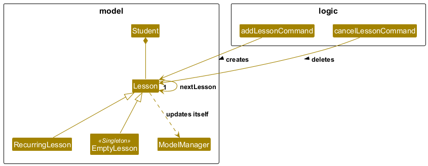

* Table of Contents
{:toc}

--------------------------------------------------------------------------------------------------------------------

## **Acknowledgements**

* **StudentConnect** is built upon the [**AB3(Address Book Level 3)**](https://se-education.org/addressbook-level3) project.
* AI-assistance in test code declaration: ChatGPT provided guidance on the JUnit test structure of `ModelManager#refreshLessonDates()` by giving an example testcase. It also provided suggestions on how to further improve test coverage for `ModelManager#refreshLessonDates()` and `cancelLessonCommandTest`. The tests for `ModelManager#refreshLessonDates()` followed the example structure and are manually validated.

--------------------------------------------------------------------------------------------------------------------

## **Setting up, getting started**

Refer to the guide [_Setting up and getting started_](SettingUp.md).

--------------------------------------------------------------------------------------------------------------------

## **Design**

:bulb: **Tip:** The `.puml` files used to create diagrams are in this document `docs/diagrams` folder. Refer to the [_PlantUML Tutorial_ at se-edu/guides](https://se-education.org/guides/tutorials/plantUml.html) to learn how to create and edit diagrams.

### Architecture

The ***Architecture Diagram*** given above explains the high-level design of the App.

Given below is a quick overview of main components and how they interact with each other.

**Main components of the architecture**

**`Main`** (consisting of classes [`Main`](https://github.com/se-edu/addressbook-level3/tree/master/src/main/java/seedu/address/Main.java) and [`MainApp`](https://github.com/se-edu/addressbook-level3/tree/master/src/main/java/seedu/address/MainApp.java)) is in charge of the app launch and shut down.
* At app launch, it initializes the other components in the correct sequence, and connects them up with each other.
* At shut down, it shuts down the other components and invokes cleanup methods where necessary.

The bulk of the app's work is done by the following four components:

* [**`UI`**](#ui-component): The UI of the App.
* [**`Logic`**](#logic-component): The command executor.
* [**`Model`**](#model-component): Holds the data of the App in memory.
* [**`Storage`**](#storage-component): Reads data from, and writes data to, the hard disk.

[**`Commons`**](#common-classes) represents a collection of classes used by multiple other components.

**How the architecture components interact with each other**

The *Sequence Diagram* below shows how the components interact with each other for the scenario where the user issues the command `delete 1`.

Each of the four main components (also shown in the diagram above),

* defines its *API* in an `interface` with the same name as the Component.
* implements its functionality using a concrete `{Component Name}Manager` class (which follows the corresponding API `interface` mentioned in the previous point.)

For example, the `Logic` component defines its API in the `Logic.java` interface and implements its functionality using the `LogicManager.java` class which follows the `Logic` interface. Other components interact with a given component through its interface rather than the concrete class (reason: to prevent outside component's being coupled to the implementation of a component), as illustrated in the (partial) class diagram below.

The sections below give more details of each component.

### UI component

The **API** of this component is specified in [`Ui.java`](https://github.com/se-edu/addressbook-level3/tree/master/src/main/java/seedu/address/ui/Ui.java)

The UI consists of a `MainWindow` that is made up of parts e.g.`CommandBox`, `ResultDisplay`, `PersonListPanel`, `StatusBarFooter` etc. All these, including the `MainWindow`, inherit from the abstract `UiPart` class which captures the commonalities between classes that represent parts of the visible GUI.

The `UI` component uses the JavaFx UI framework. The layout of these UI parts are defined in matching `.fxml` files that are in the `src/main/resources/view` folder. For example, the layout of the [`MainWindow`](https://github.com/se-edu/addressbook-level3/tree/master/src/main/java/seedu/address/ui/MainWindow.java) is specified in [`MainWindow.fxml`](https://github.com/se-edu/addressbook-level3/tree/master/src/main/resources/view/MainWindow.fxml)

The `UI` component,

* executes user commands using the `Logic` component.
* listens for changes to `Model` data so that the UI can be updated with the modified data.
* keeps a reference to the `Logic` component, because the `UI` relies on the `Logic` to execute commands.
* depends on some classes in the `Model` component, as it displays `Person` object residing in the `Model`.

### Logic component

**API** : [`Logic.java`](https://github.com/se-edu/addressbook-level3/tree/master/src/main/java/seedu/address/logic/Logic.java)

Here's a (partial) class diagram of the `Logic` component:

The sequence diagram below illustrates the interactions within the `Logic` component, taking `execute("delete 1")` API call as an example.

:information_source: **Note:** The lifeline for `DeleteCommandParser` should end at the destroy marker (X) but due to a limitation of PlantUML, the lifeline continues till the end of diagram.

How the `Logic` component works:

1. When `Logic` is called upon to execute a command, it is passed to an `AddressBookParser` object which in turn creates a parser that matches the command (e.g., `DeleteCommandParser`) and uses it to parse the command.
2. This results in a `Command` object (more precisely, an object of one of its subclasses e.g., `DeleteCommand`) which is executed by the `LogicManager`.
3. The command can communicate with the `Model` when it is executed (e.g. to delete a person). 
   Note that although this is shown as a single step in the diagram above (for simplicity), in the code it can take several interactions (between the command object and the `Model`) to achieve.
4. The result of the command execution is encapsulated as a `CommandResult` object which is returned back from `Logic`.

Here are the other classes in `Logic` (omitted from the class diagram above) that are used for parsing a user command:

How the parsing works:
* When called upon to parse a user command, the `AddressBookParser` class creates an `XYZCommandParser` (`XYZ` is a placeholder for the specific command name e.g., `AddCommandParser`) which uses the other classes shown above to parse the user command and create a `XYZCommand` object (e.g., `AddCommand`) which the `AddressBookParser` returns back as a `Command` object.
* All `XYZCommandParser` classes (e.g., `AddCommandParser`, `DeleteCommandParser`, ...) inherit from the `Parser` interface so that they can be treated similarly where possible e.g, during testing.

### Model component
**API** : [`Model.java`](https://github.com/se-edu/addressbook-level3/tree/master/src/main/java/seedu/address/model/Model.java)

#### The `Model` component

* stores the address book data i.e., all `Person` objects (which are contained in a `UniquePersonList` object).
* stores the currently 'selected' `Person` objects (e.g., results of a search query) as a separate _filtered_ list which is exposed to outsiders as an unmodifiable `ObservableList<Person>` that can be 'observed' e.g. the UI can be bound to this list so that the UI automatically updates when the data in the list change.
* stores a `UserPref` object that represents the user’s preferences. This is exposed to the outside as a `ReadOnlyUserPref` objects.
* does not depend on any of the other three components (as the `Model` represents data entities of the domain, they should make sense on their own without depending on other components)

:information_source: **Note:** An alternative (arguably, a more OOP) model is given below. It has a `Tag` list in the `StudentConnect`, which `Person` references. This allows `StudentConnect` to only require one `Tag` object per unique tag, instead of each `Person` needing their own `Tag` objects. 

#### The `Student` Component
* The student component is a new component that is introduced in the application StudentConnect. It directly inherits from person and has two extra fields, `Lesson` and `PaymentStatus`.
* The behaviour of the student class is mostly similar to a person in the model, as it directly inherits from a person. However, in StudentConnect, you can manage the most recent lesson of that student and the payment status of that particular student. Moreover, `students` can be labelled based on their respective education levels, which is an enum that records fixed values of education levels(such as P3, etc.)

#### The `Lesson` Component
* The lesson component represents a single lesson that is owned by a student who is already instantiated in the student list. A Lesson is an **immutable object** that contains a single field of `lessonDate`, which is a `LocalDate` Java object that records the date of a lesson.
* There is a static instance of a singleton object stored in the `Lesson` class named `EMPTY`, which represents the state where the student does not have any lessons. It is an instance of `Lesson`'s private subclass `EmptyLesson`. It serves as a check on whether the student has any lessons. It also handles all situations whenever an operation that deals with the lesson a student is called on a student while the student has no lesson.
* Another subclass of lesson is called `RecurringLesson`, which handles lessons that regularly update themselves after a certain time interval. It has an `interval` field that tracks the number of days between each lesson.(See the next bullet point for more details)
* The behaviour of a lesson object is mostly tied to the commands that create or delete a lesson. Additionally, whenever the application is launched. The `ModelManager` will check whether the lesson date is past the current date. If so, the lesson will be updated by calling the method `getNextLesson()`, which returns the `EMPTY` instance for a normal lesson. However, for a recurring lesson, it will return a **new instance** of the lesson whose date is `INTERVAL` days past the previous lesson date.

#### Payment Status
The payment status contains an integer which represents **the number of lessons that students have paid - the number of lessons that need to be paid**. Every single student has exactly one payment status.

We check whether the student has an outstanding lesson by checking whether the payment status equals `0`. 

* If the student has paid for `10` lessons and `13` lessons have passed in total, the payment status will be `-10+13 = 3`, which means that the student has **3 outstanding lessons that need to be paid**. You can combine this with the tag feature to also record the price of each lesson, and everything becomes easy calculation.

**The number of lessons that students have paid for** can be tracked manually or automatically. 

The payment command updates the payment command manually by adding 1(`s/unpaid`) or subtracting 1(`s/paid`) to a new lesson.

For automatic update, the payment status updates itself when the `LESSONDATE` of a lesson is past the current date(the system date). The application checks this when it is first launched. The check and the update are then done in the `ModelManager` class. If the `LESSONDATE` of a lesson is past the current date(the system date), the payment status will increase by 1.  

#### Education Level
The education level is an `enum` object that represents the student's education level. It accepts a wide range of inputs that convert the string input to the Enumeration value. The payment status of a student can be edited using the `addStu` or `edit` command. 

**Supported Education Levels**

The `enum` contains the following fields  

* `primary [n]`, where `1 <= n <= 6`
* `secondary [n]`, where `1 <= n <= 5`
* `junior [n]`, where `1 <= n <= 2`("junior" refers to junior college)

**Flexible Input Formats**

When we convert the education level `enum` from a `String` input (from a command) to an enum object, several string inputs are supported for one `enum` item. 
For example, the following `Strings` converts to the enum item `primary 3`:
* **Original form:** `primary 3`  
Full words + number 
* **Abbreviation:** `pri 3`     
primary → pri, secondary → sec, junior → jc (no other forms allowed)
* **Number in words:** `primary three`  
You may combine with abbreviations too, e.g. `pri three`

### Storage component

**API** : [`Storage.java`](https://github.com/se-edu/addressbook-level3/tree/master/src/main/java/seedu/address/storage/Storage.java)

The `Storage` component,
* can save both address book data and user preference data in JSON format, and read them back into corresponding objects.
* inherits from both `AddressBookStorage` and `UserPrefStorage`, which means it can be treated as either one (if only the functionality of only one is needed).
* depends on some classes in the `Model` component (because the `Storage` component's job is to save/retrieve objects that belong to the `Model`)

### Common classes

Classes used by multiple components are in the `seedu.address.commons` package.

--------------------------------------------------

## **Implementation**

This section describes some noteworthy details on how certain features are implemented.

### addStu/delete feature

 The `addStu`/`delete` mechanism in `StudentConnect` builds the foundation of the application. It adds a student and deletes the student, which is represented as an item in the student list.

Given below is an example usage scenario and how the addStu/delete mechanism behaves at each step.

Step 1. The user launches the application for the first time.`StudentConnect` will be initialized with the initial address book state.

Step 2. The user executes `addStu n/David …​` to add a new person. A new `student` object is created and the student is appended as the last element of the student list. The `addStu` command also calls the storage and UI, causing the newly created student to be saved into the file `addressbook.json` (We kept the name for the data file) and displayed on the interface.

Step 3. The user executes `delete 2` command to delete the 5th person in the address book. The `delete` command is called, causing the second student that appears in the student list to be deleted. Then the deletion of the student from the student list is observed by the UI and storage, leading to corresponding updates on the interface and in the file `addressbook.json`

:information_source: **Note:**
 If a command fails its execution, it will not update the storage and the UI, so the storage and the student list on the interface remains the same state as before.

## **Documentation, logging, testing, configuration, dev-ops**

* [Documentation guide](Documentation.md)
* [Testing guide](Testing.md)
* [Logging guide](Logging.md)
* [Configuration guide](Configuration.md)
* [DevOps guide](DevOps.md)

--------------------------------------------------------------------------------------------------------------------

## **Appendix: Requirements**

### Product scope

**Target user profile**: Private tutors

* has a need to manage a significant number of student/parent contacts
* has a need to keep track of student's subjects
* has to keep track of student's weekly meeting time
* prefer desktop apps over other types
* can type fast
* prefers typing to mouse interactions
* is reasonably comfortable using CLI apps

**Value proposition**: provides tutors a fast way to organize contacts, lesson schedules, and guardian details, ensuring no confusion about classes or missed communication with parents.

### User stories

Priorities: High (must have) - `* * *`, Medium (nice to have) - `* *`, Low (unlikely to have) - `*`

| Priority | As a …​            | I want to …​                                                  | So that I can…​                                              |
|----------|--------------------|---------------------------------------------------------------|--------------------------------------------------------------|
| `* * *`  | As a private tutor | I want to be able to add my students’ contacts                | so that I can remember them                                  |
| `* * *`  | As a private tutor | I want to be able to delete a student contact                 | so that they are not in my contact list                      |
| `* * *`  | As a private tutor | I want to search the student’s contact information            | so that I can locate them easily                             |
| `* * *`  | As a private tutor | I want to track payment status per lesson                     | so that I know which lessons have been paid for              |
| `* * *`  | As a private tutor | I want to see which students have unpaid lessons              | so that I can follow up on payments                          |
| `* * *`  | As a private tutor | I want to track my students' education level                  | so that I can tailor my lessons accordingly                  |
| `* * *`  | As a private tutor | I want to search for students by tags                         | so that I can quickly filter students with specific subjects |
| `* * *`  | As a private tutor | I want to add multiple tags to students                       | so that I can categorise students in different ways          |
| `* * *`  | As a private tutor | I want to be able to edit my students' information            | so that I can keep their information up to date              |
| `* * *`  | As a private tutor | I want to be able to cancel my student's lesson               | so that I can manage schedule changes                        |
| `* * *`  | As a private tutor | I want to keep track of my students’ (recurrent) lesson times | so that I will not forget about the schedules                |

### Use cases

(For all use cases below, the **System** is the `StudentConnect` and the **Actor** is the `user`, unless specified otherwise)

**Use case: UC1 - Add a student**

**MSS**

1.  User requests to add student's contact
2.  StudentConnect adds the student.

    Use case ends.

**Extensions**

* 2a. The student has already been added.

    * 2a1. StudentConnect shows an error.

    Use case ends.

* 2b. The required fields keyed in are wrong.

    * 2b1. StudentConnect shows an error.

        Use case resumes at step 1. 

  
    Use case ends.

**Use case: UC2 - Delete a student**

**MSS**

1.  User requests to delete a student
2.  StudentConnect deletes the student and all associated data

       Use case ends.

**Extensions**

* 2a. The student doesn't exist.

    * 2a1. StudentConnect returns `0 persons listed!`.

        Use case resumes at step 2.

* 2b. Invalid index provided.

    * 2b1. StudentConnect shows an error message
  
        Use case resumes at step 2.

    
    Use case ends.

**Use case: UC3 - Search for a student**

**MSS**

1.  User requests to search for a student
2.  StudentConnect lists the student

       Use case ends.

**Extensions**

* 2a. The student doesn't exist.

    * 2a1. StudentConnect shows an error message.

      Use case resumes at step 2.

  
    Use case ends.

**Use case: UC4 - Add a (recurring) lesson for a student**

**MSS**

1.  User requests to add a (recurring) lesson for a student
2.  StudentConnect adds the (recurring) lesson date for the student

       Use case ends.

**Extensions**

* 1a. The student doesn't exist.

    * 1a1. StudentConnect shows an error message.

      Use case resumes at step 1.

* 1b. The student already has an allocated lesson.

    * 1b1. StudentConnect shows an error message.
      
      Use case resumes at step 1.

* 1c. The lesson date is invalid.

    * 1c1. StudentConnect shows an error message.

      Use case resumes at step 1.

    Use case ends.

**Use case: UC5 - Cancels a (recurring) lesson for a student**

**MSS**

1.  User requests to cancel a (recurring) lesson for a student
2.  StudentConnect cancels the (recurring) lesson for the student

       Use case ends.

**Extensions**

* 1a. The student doesn't exist.

    * 1a1. StudentConnect shows an error message.

      Use case resumes at step 1.

* 1b. The student has no lessons allocated.

    * 1b1. StudentConnect shows an error message.

      Use case resumes at step 1.

* 1c. The index is invalid.

    * 1c1. StudentConnect shows an error message.
  
      Use case resumes at step 1.

    Use case ends.

**Use case: UC6 - Mark student as having paid lesson**

**MSS**

1.  User marks student as having paid lesson.
2.  StudentConnect marks the student's payment status as paid.

       Use case ends.

**Extensions**

* 1a. The student doesn't exist.

    * 1a1. StudentConnect shows an error message.

      Use case resumes at step 1.

* 1b. The student's payment status is already paid.

    * 1b1.  StudentConnect throws an error.
  
      Use case resumes at step 1.

* 1c. The index is invalid.

    * 1c1.  StudentConnect throws an error.

      Use case resumes at step 1.

        Use case ends.

**Use case: UC7 - Mark student as not having paid lesson**

**MSS**

1.  User marks student as having not paid lesson.
2.  StudentConnect marks the student's payment status as unpaid.

       Use case ends.

**Extensions**

* 1a. The student doesn't exist.

    * 1a1. StudentConnect shows an error message.

      Use case resumes at step 1.

* 1b. The index is invalid.

    * 1b1.  StudentConnect throws an error.

      Use case resumes at step 1.

        Use case ends.

**Use case: UC8 - Edit a student's information**

**MSS**

1.  User requests to edit a student's information.
2.  StudentConnect edits the student's information.

       Use case ends.

**Extensions**

* 1a. The index is invalid.

    * 1a1. StudentConnect shows an error message.

      Use case resumes at step 1.

* 1b. No fields to edit are given.

    * 1b1. StudentConnect shows an error message.

      Use case resumes at step 1.

        Use case ends.

**Use case: UC9 - Search for tags**

**MSS**

1.  User requests to search for tags.
2.  StudentConnect searches through the list based on tags.
3.  StudentConnect returns the required list.

       Use case ends.

**Extensions**

* 1a. The tag is invalid.

    * 1a1. StudentConnect shows an error message.

      Use case resumes at step 1.

* 1b. No tags are provided.

    * 1b1. StudentConnect shows an error message.
  
      Use case resumes at step 1.

        Use case ends.

### Non-Functional Requirements

1.  Should work on any _mainstream OS_ as long as it has Java `17` or above installed.
2.  Should be able to hold up to 1000 persons without a noticeable sluggishness in performance for typical usage.
3.  A user with above average typing speed for regular English text (i.e. not code, not system admin commands) should be able to accomplish most of the tasks faster using commands than using the mouse.

### Glossary

* **Mainstream OS**: Windows, Linux, Unix, macOS
* **Private contact detail**: A contact detail that is not meant to be shared with others
* **Student** : A recordable entity in the application **StudentConnect**, which inherits itself from the `person` class used in the previous AddressBook application.
* **Student List** : The panel at the bottom of the StudentConnect interface displaying all student profiles that have been created and stored in the system. It provides a quick overview of existing students for easy reference and selection.
* **Lesson**: An entity which contains a `LocalDate` that is owned by a student. It meaningfully represents the next lesson that the student will have. The `LocalDate` represents the date that the lesson starts.
* **Recurring lesson**: A lesson arrangement set on a fixed weekly schedule, where the tutor conducts lessons with a student on the same day each time interval. 
* **Payment Status:** A positive numerical value that indicates the student’s current payment balance for lessons. The value means the student has outstanding lessons that are yet to be paid.
* **Education Level:** An Enum field used to record the academic level of each student for organisational clarity.

--------------------------------------------------------------------------------------------------------------------

## **Appendix: Instructions for manual testing**

Given below are instructions to test the app manually.

:information_source: **Note:** These instructions only provide a starting point for testers to work on;
testers are expected to do more *exploratory* testing.

### Launch and shutdown

1. Initial launch

   1. Download the jar file and copy into an empty folder

   2. Double-click the jar file Expected: Shows the GUI with a set of sample contacts. The window size may not be optimum.

2. Saving window preferences

   1. Resize the window to an optimum size. Move the window to a different location. Close the window.

   2. Re-launch the app by double-clicking the jar file. 
       Expected: The most recent window size and location is retained.

### Deleting a person

1. Deleting a person while all persons are being shown

   1. Prerequisites: List all persons using the `list` command. Multiple persons in the list.

   2. Test case: `delete 1` 
      Expected: First contact is deleted from the list. Details of the deleted contact shown in the status message. Timestamp in the status bar is updated.

   3. Test case: `delete 0` 
      Expected: No person is deleted. Error details shown in the status message. Status bar remains the same.

   4. Other incorrect delete commands to try: `delete`, `delete x`, `...` (where x is larger than the list size) 
      Expected: Similar to previous.

### Adding a new student
1. Adding a person to the list

   1. Prerequisites: List all persons using the `list` command. Multiple students in the list.

   2. Test case: `addStu n/Alex Tan p/91223344 e/alex@example.com` 
   Expected: A student with name Alex Tan, phone number 91223344, and email alex@example.com is added to the end of the list of students.

   3. Test case: `addStu n/Choo p/81112222 a/Blk 1` 
   Expected: No new student is added. Error details shown in the status message.

   4. Other incorrect addStu commands to try: `addStu`, `addStu p/12345678 e/123@example.com`, `...`
   Expected: similar to previous.

### Editing a person
1. Editing an existing person in the list
   1. Prerequisites: List all persons using the `list` command. Multiple students in the list.

   2. Test case: `edit 2 n/Betsy Crower` 
   Expected: The person at index 2 has gotten their name changed to Betsy Crower. New details of the person shown in the status message.

   3. Test case: `edit 0 p/12345678` 
   Expected: No person is edited. Error details shown in the status message.

   4. Other incorrect edit commands to try: `edit`, `edit x n/newname`, `...` (where x is larger than the list size) 
   Expected: Similar to previous.

### Managing payment status of a person
1. Displaying or updating the payment status of a person in the list
   1. Prerequisites: List all persons using the `list` command. Multiple students in the list.
   2. Test case: `payment 2` 
   Expected: Name and payment status of the second person in the list are shown in the status message.
   3. Test case: `payment 0` 
   Expected: Error details shown in the status message.
   4. Other incorrect payment commands to try: `payment`, `payment x`,`...`(where x is larger than the list size) 
   Expected: Similar to previous.

### Locating persons by tag
1. Finding a person whose tags contain any of the given keywords
   1. Prerequisites: List all persons using the `list` command. Multiple students in the list. Ensure at least one student in the list has a tag to be tested. Otherwise, run `edit 1 t/chemistry` and `edit 2 t/physics`.
   2. Test case: `searchtag chemistry physics` 
   Expected: Message `2 person listed!` shown in the status message. The list now only contain the first two students.
   3. Test case: `searchtag` 
   Expected: The displayed list is not changed. Error details shown in the status message.

### Adding a lesson
1. Adding a lesson to an existing student
   1. Prerequisites: List all persons using the `list` command. Multiple students in the list.
   2. Test case: `addLesson 2 d/2025-12-20` 
   Expected: The person at index 2 now has a lesson on the date 2025-12-20. New details of the person shown in the status message.
   3. Test case: `addLesson 0 d/2025-12-15` 
   Expected: No lesson is added. Error details shown in the status message.
   4. Other incorrect edit commands to try: `addLesson`, `addLesson x d/2025-12-25`, `...` (where x is larger than the list size) 
   Expected: Similar to previous.

### Cancelling a lesson
1. Cancelling a lesson of an existing student
   1. Prerequisites: List all persons using the `list` command. Multiple students in the list.
   2. Test case: `cancelLesson 2` 
   Expected: The person at index 2 with a scheduled lesson will get their lesson cancelled. Lesson of the person becomes None. New details of the person shown in the status message.
   3. Test case: `cancelLesson 0` 
   Expected: No lesson is cancelled. Error details shown in the status message.
   4. Other incorrect edit commands to try: `cancelLesson`, `cancelLesson x`, `...` (where x is larger than the list size) 
   Expected: Similar to previous.

### Testing auto-update of lesson dates
1. Testing if lesson dates of all students in the list will be auto-updated as time passes
   1. Prerequisites: List all persons using the `list` command. Multiple students in the list. Ensure at least one student in the list has a lesson to be tested. If no student has a lesson, use `addLesson 1 d/2025-12-15` and `addLesson 2 d/2025-12-01 every/7`.
   2. Go to your laptop / computer's settings, search for date&ime settings. **Close `set date and time automatically`** and **close `set time zone automatically using your location`**
   3. You will now be able to adjust your system date and time manually. Set the date to be `2025-12-16`. Exit the application and re-launch it.
   Expected: The person at index 1 will now have no lessons. The person at index 2 will have a lesson on `2025-12-22`.

## Appendix 2: Planned enhancements

### 1. Support for Negative Payment Status (Overpayment Tracking)

**Description:**
The payment status system will be extended to allow negative values, enabling tutors to record situations where a student has prepaid for lessons. For example, if a student prepays for 5 lessons before attending any, the payment status will be `-5`.

**Rationale:**
Although the initial design assumes pay-as-you-go (a common practice), some private tutors — especially those managing higher lesson volume or group classes — collect payment in advance. By supporting negative balances, tutors can also record prepaid lesson credits

**Implementation Notes:**

* Validation logic for payment status will be updated to allow negative values
* Future UI/CLI updates may include indicators for prepaid credits
* Payment-related features (e.g., export / summary) will support both outstanding and prepaid balances

### 2. Precise Lesson Scheduling: Time-Based Support

**Description:**
Lesson scheduling will be enhanced to support both date and exact time, including hours and minutes (e.g., `2025-01-12 17:30`).

**Rationale:**
Tutors often manage several lessons per day at different time slots. The ability to specify time improves lesson scheduling accuracy and reminder and preparation logic.

**Implementation Notes:**

* Internal date handling will be migrated from `LocalDate` to `LocalDateTime` (or equivalent time object). Lesson sorting & UI display logic will be updated to prioritize time when available

* Potential integration with automated reminders or calendar exports in future releases

### 3. Extended Person Model for Parents / Guardians

**Description:**
The system will introduce additional person types, starting with a dedicated Parent/Guardian entity, implemented as a subclass of Person.

**Rationale:**
Private tutors frequently interact not only with students, but also with parents or guardians regarding payment coordination and scheduling adjustments.Differentiating persons ensures accurate association between student-parent pairs and better record organisation. Future support for multiple guardians per student (e.g., mother + father contacts)

**Implementation Notes:**

* A `Parent` class will inherit from `Person`
* A `Student` may reference one or more `Parent` object
* This architecture supports richer contact management, laying groundwork for optional features such as messaging integration or multi-contact notification systems.
