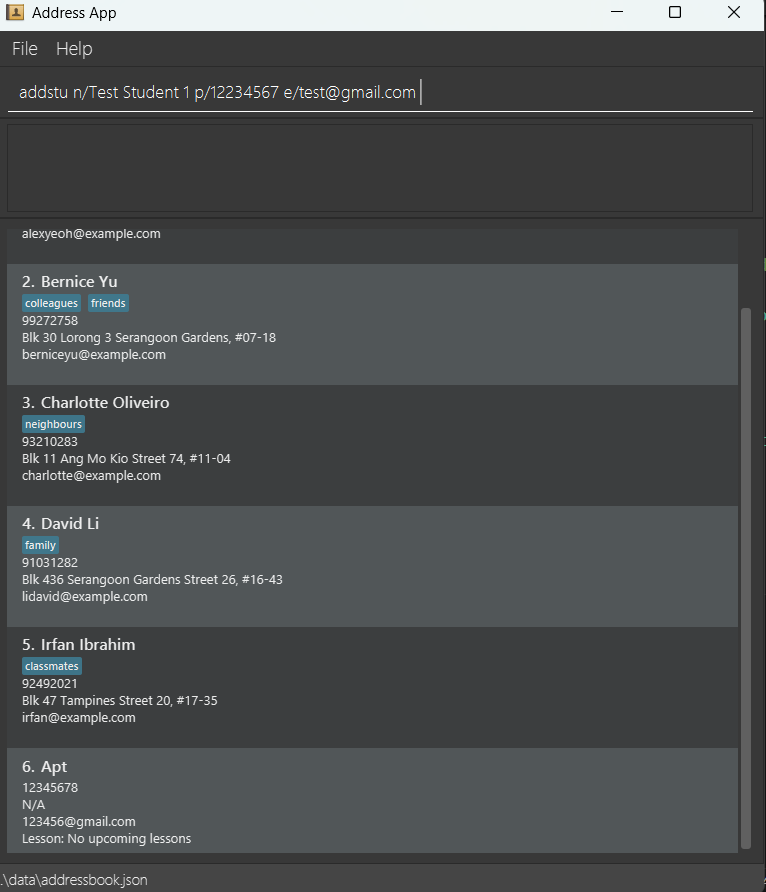

**Hi private tutors!**

**StudentConnect** is a desktop application designed to help private tutors manage student contacts and lesson schedules. With simple commands, you can record and retrieve important student information with ease.

No matter what subjects you teach, which education levels you target, or whether your lessons are online or in-person, **StudentConnect** supports your tutoring needs. If juggling multiple students feels overwhelming, our features are here to help. With just a few quick commands, you can manage student contacts, schedule lessons, and track payments — all in one place.

The Quick Start section below will guide you through your first steps. Don’t worry if you’ve never used a command-based application before — it’s simple to learn, and we’re here to help you get started!

* Table of Contents
{:toc}

- Table of Contents
  {:toc}

---

## Quick start

1. Ensure you have Java with version `17` or above installed in your Computer. Java is the platform that we use to run our application. You can clck the following link to download the platform and install it by double clicking the downloaded file and follow the installation guide 
   **window users:** You can download your JDK platform [here](https://www.oracle.com/java/technologies/downloads/?er=221886#jdk25-windowshttps://www.java.com/en/download/manual.jsp)
   **Mac users:** Ensure you have the precise JDK version prescribed [here](https://se-education.org/guides/tutorials/javaInstallationMac.html).

:information_source:**How to check whether my Java version is above 17?** 
If you use these websites links to download the platform, they are from the latest versions that are far above 17. No worries!

2. Download the latest version of our application as a `.jar` file from [here](https://github.com/se-edu/addressbook-level3/releases). This is going to be the body of our application. 

3. Once you have downladed the file, copy the file to the folder you want to use as the _home folder_ for your AddressBook. You need a place where the data of the appication can be stored so **make sure that you place the file in an empty folder.**

4. There are a few different ways to launch the application :
* double click the `.jar` file that you have downloaded.
* *(For advanced command app users)* Open a command terminal,  `cd` into the folder you put the jar file in, and use the `java -jar addressbook.jar` command to run the application. 
   The application interface similar to the below should appear in a few seconds. Note how the app contains some sample data. 
   

5. Type the command in the command box and press Enter to execute it. e.g. typing **`help`** and pressing Enter will open the help window. 
   Some example commands you can try:

**5. Try out some basic commands** 
Type a command in the box and press Enter to run it. 

Here are a few to get you started:

* `help` &ndash; Opens the help window.

* `list` &ndash; Lists all contacts.

* `addstu n/John Doe p/98765432 e/johnd@example.com` &ndash; Adds a student named `John Doe`.

* `delete 3` &ndash; Deletes the 3rd contact shown in the current list.

* `clear` &ndash; Deletes all contacts.

* `exit` &ndash; Exits the app.

**6. Explore more features** 
Check out the [Features](#features) below for a full list of commands and details.

--------------------------------------------------------------------------------------------------------------------

**:information_source: Notes about the command format:** 

* Words in `UPPER_CASE` are the parameters to be supplied by you. 
  e.g. in `add n/NAME`, `NAME` is a parameter which can be used as `add n/John Doe`.

* Items in square brackets are optional. 
  e.g. `n/NAME [t/TAG]` can be used as `n/John Doe t/friend` or as `n/John Doe`.

- Items with `…`​ after them can be used multiple times including zero times. 
  e.g. `[t/TAG]…​` can be used as ` ` (i.e. 0 times), `t/friend`, `t/friend t/family` etc.

- Parameters can be in any order. 
  e.g. if the command specifies `n/NAME p/PHONE_NUMBER`, `p/PHONE_NUMBER n/NAME` is also acceptable.

- Extraneous parameters for commands that do not take in parameters (such as `help`, `list`, `exit` and `clear`) will be ignored. 
  e.g. if the command specifies `help 123`, it will be interpreted as `help`.

- If you are using a PDF version of this document, be careful when copying and pasting commands that span multiple lines as space characters surrounding line-breaks may be omitted when copied over to the application.

--------------------------------------------------------------------------------------------------------------------

## Basic Concepts

To have a better understanding of how we process the commands in StudentConnect, you can take a look at the basic concepts here!

### Student
A student is represented as an item in the student list. You can add a student by calling the [`addstu`](#adding-a-new-student-addstu) command and delete a student by calling the [`delete`](#deleting-a-person--delete) command. Once a student is added, it will appear on the list at the bottom of the panel, with a number index assigned to the student. 
The number index is based on the order that the student is added into the list.

A student has the following attributes, as shown on the example above:
1. name: The name of the student
2. phone number: The phone number of a student
3. email address: The email address of a student
4. address: The address of the student (This is optional, so you do not need to include this if you are hosting online lessons)
5. [tag](#tag-): Tags that record extra information of a student
6. [lesson](#lesson): The lesson that the student has

A student can only have **zero or one lesson**. If you try to add a new lesson to a student which already has a lesson, you will receive an error.

### Student list
The list of the student that appears at the bottom of the application interface. It shows all students that is stored in the application. These students in the student list can be accessed by commands such as [`addLesson`](#add-a-lesson--addlesson), whenever we need to refer to a specific student that is **already created**.
 
### Tag 
A tag is a piece of text that records a unique characteristic of the student. You can add optionally add any number of tags when you create a new [student](#student) by calling the [`addstu`](#adding-a-new-student-addstu) command.

In StudentConnect, you can use the tag in the following way:
1. Record the subject of the [student](#student) (e.g. `history`, `chemistry`) if you teach multiple subjects
2. Record information about the [student](#student) that you need to remind yourself (e.g. `50$/hr`)
3. Record whether you need to provide feedbacks to the [student](#student)'s parents (e.g. `feedback/no-feedback`)
4. Record the platform that you use if you are hosting online lessons(e.g. `platform:Giggle meet`)

### Lesson

A lesson is represented by a single date, which is the date (in the fixed format of `yyyy-MM-dd`) that the lesson starts. We assume that the lesson will end on the same day
* For instance, a lesson that starts at `November 10th 2024 5pm` should be represented as `2024-11-10` in the system.
 
When a student is created, the student by default does not have any lesson. To record an upcoming lesson to the student, use [addLesson](#add-a-lesson--addlesson) command to create a new lesson to the [student](#student) in the [student list](#student-list)

A lesson is considered **passed** if the date of lesson recorded is **before the current date**(Note that if the lesson date is the same as the current date, it is **not considered passed**). If a lesson is **passed**, the lesson will be dropped from the student who had the lesson, so the student will no longer have any lesson again. Lessons are updated whenever the application is launched.

--------------------------------------------------------------------------------------------------------------------

## Advance Concepts

### Recurring lessons

As most tutors conduct lessons regularly—such as every week or every few days—**recurring lessons** help you keep track of lessons that happen on a routine schedule.

A **recurring lesson** has two key attributes:

* **`LESSONDATE`**: the date when the first lesson starts
* **`INTERVAL`**: the number of days between each lesson

For example, if your lesson starts on `2025-10-10` and occurs once every week, then:

* `LESSONDATE` = `2025-10-10`
* `INTERVAL` = `7`

The system automatically updates a recurring lesson whenever its `LESSONDATE` is earlier than the current date. It does this by adding the `INTERVAL` (in days) to the previous `LESSONDATE`, moving it forward to the next scheduled lesson.

For instance:

* Today’s date = `2025-10-20`
* Current `LESSONDATE` = `2025-10-19`
* `INTERVAL` = `7`

Since the recorded lesson date has already passed, the system updates it to **2025-10-26** — one week later.

This ensures your recurring lessons always reflect the *next upcoming* session without requiring manual changes.

### Payment Status
Payment tracking has been an anathema to private tutors, especially when there are multiple students with different payment habits. We use the payment status to make this issue simple.

The payment status records the balance between **the number of lessons that students has paid** or the **number of lessons that has passed**
* If the student has paid for `10` lessons and `13` lessons has passed in total, the payment status will be `10-13 = -3`, which means that the students has **3 outstanding lessons that needs to be paid**. You can combine this with the [tag](#tag-) feature to also record the price of each lesson and everything becomes easy calculation.

**The number of lessons that students has paid** is tracked manually. You can update this by using [payment](#payment-status) command.
**The number of lessons passed** is automatically updated whenever a lesson has passed(See [lesson](#lesson) for more details).

--------------------------------------------------------------------------------------------------------------------

## Features

### Getting help : `help`

Shows a message explaining how to access the help page.

Format: `help`

### Adding a new student: `addStu`

:bulb: **Warning:**
The `add` command available in the previous versions is deprecated and cannot be used anymore.
Use this command instead to add a new student

Adds a person to the address book.

Format: `addstu n/NAME p/PHONE_NUMBER e/EMAIL [a/ADDRESS] [t/TAG]…​ [edu/EDUCATION_LEVEL]

:bulb: **Tip:**
A person can have 0 or 1 address
A person can have any number of tags (including 0)
All other fields are compulsory
When a student is initialised, *by default* : 
1. the student has not paid for any lesson(refer to track for more info)
2. the student does not have any lesson (refer to addLesson for more info)
3. If `edu/` is omitted, the education level defaults to `UNKNOWN`. 

Examples:
* `addstu n/John Doe p/98765432 e/johnd@example.com a/John street, block 123, #01-01 edu/primary 3`
* `addstu n/Betsy Crowe t/friend e/betsycrowe@example.com p/1234567 t/history edu/sec 2`
* `addstu n/Cindy Wong p/12355677 e/12345@example.com edu/j1`
* `addstu n/Choo P p/81112222 e/choo@example.com a/Blk 1 edu/other`
* `addstu n/Alex Tan p/91223344 e/alex@example.com`

### Listing all persons : `list`

Shows a list of all persons in the address book.

Format: `list`

### Editing a person : `edit`

Edits an existing person in the address book.

Format: `edit INDEX [n/NAME] [p/PHONE] [e/EMAIL] [a/ADDRESS] [t/TAG]…​ [edu/EDUCATION_LEVEL]…​`

* Edits the person at the specified `INDEX`. The index refers to the index number shown in the displayed person list. The index **must be a positive integer** 1, 2, 3, …​
* At least one of the optional fields must be provided.
* Existing values will be updated to the input values.
* When editing tags, the existing tags of the person will be removed i.e. adding of tags is not cumulative.
* You can remove all the person’s tags by typing `t/` without specifying any tags after it.
* To change the education level, provide edu/EDUCATION_LEVEL. To clear it back to UNKNOWN, pass edu/ with nothing after it.

Examples:
*  `edit 1 p/91234567 e/johndoe@example.com` Edits the phone number and email address of the 1st person to be `91234567` and `johndoe@example.com` respectively.
*  `edit 2 n/Betsy Crower t/` Edits the name of the 2nd person to be `Betsy Crower` and clears all existing tags.
*  `edit 3 edu/sec 4` Changes the 3rd person's education level to SEC_4.
*  `edit 4 edu/` Clears the 4th person's education level back to UNKNOWN.

### Locating persons by name: `find`

Finds persons whose names contain any of the given keywords.

Format: `find KEYWORD [MORE_KEYWORDS]`

* The search is case-insensitive. e.g. `hans` will match `Hans`
* The order of the keywords does not matter. e.g. `Hans Bo` will match `Bo Hans`
* Only the name is searched.
* Only full words will be matched e.g. `Han` will not match `Hans`
* Persons matching at least one keyword will be returned (i.e. `OR` search).
  e.g. `Hans Bo` will return `Hans Gruber`, `Bo Yang`

Examples:

- `find John` returns `john` and `John Doe`
- `find alex david` returns `Alex Yeoh`, `David Li` 
  

### Payment Status of a person : `payment`

Displays or updates the payment status of a person in the address book.

Format: `payment INDEX [s/paid | s/unpaid]`

* Check payment status of the person at the specified `INDEX`.
  * The index refers to the index number shown in the displayed person list.
  * The index **must be a positive integer** 1, 2, 3, …​
* Optionally, you may include a status flag (`s/paid` or `s/unpaid`) to update the student's payment status.
  * Vertical bar `|` means “or” i.e. you can choose only one of the options given.
* When a status flag is provided, the system updates the student’s payment record accordingly.

Examples:
* `list` followed by `payment 2` displays payment status of the 2nd person in the address book.
* `list` followed by `payment 2 s/paid` marks 1 lesson of 2nd person in the address book as paid. Then displays the updated payment status of the 2nd person in the address book.
* `list` followed by `payment 2 s/unpaid` marks 1 lesson of 2nd person in the address book as unpaid. Then displays the updated payment status of the 2nd person in the address book.

### Locating persons by tag: `searchtag`

Finds persons whose tags contain any of the given keywords.

Format: `searchtag KEYWORD [MORE_KEYWORDS]`

* The search is case-insensitive. e.g. `chem` will match `Chem`
* The order of the keywords does not matter. e.g. `chemistry physics` will match `physics chemistry`
* Only tags are searched.
* Partial matches are allowed. e.g. `chem` will match `chemistry`
* Persons matching at least one keyword will be returned (i.e. `OR` search).
  e.g. physics math will return all persons with either tag.

Examples:
* `searchtag cHemiStrY` returns all persons tagged with `chemistry`
* `searchtag Fri Col` returns all persons with tags containing `fri` (e.g. `friends`) or `col` (e.g. `colleagues`)
  

### Deleting a person : `delete`

Deletes the specified person from the address book.

Format: `delete INDEX`

- Deletes the person at the specified `INDEX`.
- The index refers to the index number shown in the displayed person list.
- The index **must be a positive integer** 1, 2, 3, …​

Examples:

- `list` followed by `delete 2` deletes the 2nd person in the address book.
- `find Betsy` followed by `delete 1` deletes the 1st person in the results of the `find` command.

### Add a lesson : `addLesson`

Add the scheduled upcoming lesson for the specified person.

Format: `addLesson INDEX l/LESSON_DATE [every/INTERVAL]`

* Adds a lesson for the student at the specified `INDEX`
* The index refers to the index number shown in the displayed person list.
* The index **must be a positive integer** 1, 2, 3, …​
* If the person is a student **with a scheduled lesson**, the command shows an error. This is true also for recurring lessons.
* If they are a student **with no scheduled lesson**, the upcoming lesson will be added and displayed in the address book.
* The `LESSONDATE` refers to the date of the lesson to be added. It follows a strict format of `yyyy-MM-dd`(e.g. `2025-10-05`, note that `2025-10-1` or `2025-1-10` **are considered as wrong formats** because your month and date must be **in two characters**). The start date of the lesson is only considered valid when it is within the range from the **current date where you add the lesson** until **364 days past that current date**. This is to prevent unreasonable inputs.
* If you want to add a **recurring lesson**, a lesson that refreshes itself after a fixed number of days, you can use the optional `every/` identifier with a **positive integer** to indicate after how many days will the lesson automatically update itself to the next date instead of deleting itself. When you do not have the `every/` identifier. The lesson will be counted as a normal lesson, which automatically deletes itself after the date of the lesson has passed.

Examples:
* `list` followed by `addLesson 2 l/Wednesday` add the 2nd person's upcoming lesson and displays it in the address book.
* `find Betsy` followed by `addLesson 1 l/Monday` adds the 1st person's lesson and displays it in the address book.

### Cancel a lesson : `cancelLesson`

Cancels the scheduled upcoming lesson at the specified index.

Format: `cancelLesson INDEX`

* The index refers to the index number shown in the displayed person list.
* The index **must be a positive integer** not greater than the total number of persons in the address book.
* This command checks if the person at the specified index is a student.
* If the person is not a student, the command returns an error message.
* If the person is a student with a scheduled lesson, the command cancels that lesson.
* If they are a student with no scheduled lesson, an error message will be displayed.

Examples:
* `list` followed by `cancelLesson 6` cancels the 6th person's upcoming lesson if the 6th person is a student with a scheduled lesson.

* `find Betsy` followed by `cancelLesson 1` cancels the lesson of the 1st person in the results of the `find` command if they are a student with a scheduled lesson.

### Clearing all entries : `clear`

Clears all entries from the address book.

Format: `clear`

### Exiting the program : `exit`

Exits the program.

Format: `exit`

--------------------------------------------------------------------------------------------------------------------

## Managing Data Storage

### Saving the data

AddressBook data are saved in the hard disk automatically after any command that changes the data. There is no need to save manually.

### Editing the data file

AddressBook data are saved automatically as a JSON file `[JAR file location]/data/addressbook.json`. Advanced users are welcome to update data directly by editing that data file.

:exclamation: **Caution:**
If your changes to the data file makes its format invalid, AddressBook will discard all data and start with an empty data file at the next run. Hence, it is recommended to take a backup of the file before editing it. 
Furthermore, certain edits can cause the AddressBook to behave in unexpected ways (e.g. if a value entered is outside the acceptable range). Therefore, edit the data file only if you are confident that you can update it correctly.

--------------------------------------------------------------------------------------------------------------------

## FAQ

**Q**: How do I transfer my data to another computer? 
**A**: Install the app in the other computer and overwrite the empty data file it creates with the file that contains the data of your previous AddressBook home folder.

**Q**: How do I edit student information if I input anything wrong? 
**A**: StudentConnect so far does not support edit function. You may use the command `delete INDEX` first and then recreate the student.

**Q**: If I add a lesson on the day of the lesson itself, is it counted as being outdated? 
**A**: No, your lesson will only delete/update itself (depending on the type of the lesson) after the date of the lesson has passed. For example, if today is `2025-10-29` and your lesson is set on that day. It will only be considered outdated on `2025-10-30`.

--------------------------------------------------------------------------------------------------------------------

## Known issues

1. **When using multiple screens**, if you move the application to a secondary screen, and later switch to using only the primary screen, the GUI will open off-screen. The remedy is to delete the `preferences.json` file created by the application before running the application again.
2. **If you minimize the Help Window** and then run the `help` command (or use the `Help` menu, or the keyboard shortcut `F1`) again, the original Help Window will remain minimized, and no new Help Window will appear. The remedy is to manually restore the minimized Help Window.

---

## Command summary

| Action             | Format, Examples                                                                                                                                                                                          |
|--------------------|-----------------------------------------------------------------------------------------------------------------------------------------------------------------------------------------------------------|
| **Add Student**    | `addstu n/NAME p/PHONE_NUMBER e/EMAIL [a/ADDRESS] [t/TAG]…​ [edu/EDUCATION_LEVEL]`   e.g. `add n/James Ho p/22224444 e/jamesho@example.com a/123, Clementi Rd, 1234665 t/friend t/colleague edu/sec 4` |
| **Add Lesson**     | `addLesson INDEX l/LESSONDATE [every/INTERVAL]​`   e.g. `addLesson n/Paul l/2025-11-13`                                                                                                                |
| **Cancel Lesson**  | `cancelLesson INDEX​`   e.g. `cancelLesson 3`                                                                                                                                                          | 
| **Clear**          | `clear`                                                                                                                                                                                                   |
| **Delete**         | `delete INDEX`  e.g. `delete 3`                                                                                                                                                                        |
| **Edit**           | `edit INDEX [n/NAME] [p/PHONE_NUMBER] [e/EMAIL] [a/ADDRESS] [t/TAG]…​`  e.g.`edit 2 n/James Lee e/jameslee@example.com`                                                                                |
| **Find**           | `find KEYWORD [MORE_KEYWORDS]`  e.g. `find James Jake`                                                                                                                                                 |
| **Search Tag**     | `searchtag KEYWORD [MORE_KEYWORDS]`  e.g. `searchtag chemistry physics`                                                                                                                                |
| **List**           | `list`                                                                                                                                                                                                    |
| **Payment Status** | `payment INDEX [s/paid \| s/unpaid]`  e.g. `payment 1 s/unpaid`                                                                                                                                        |
| **Help**           | `help`                                                                                                                                                                                                    |
